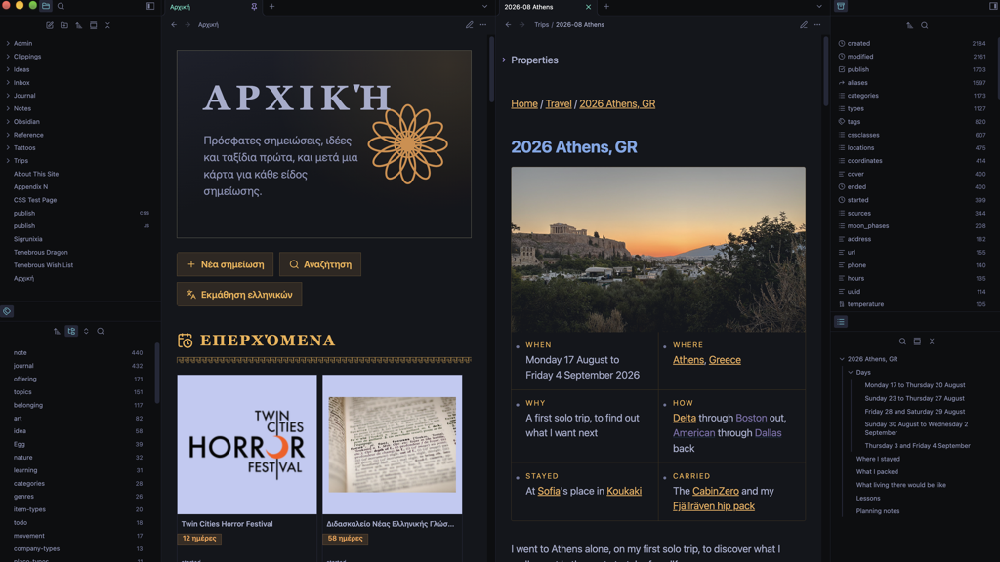
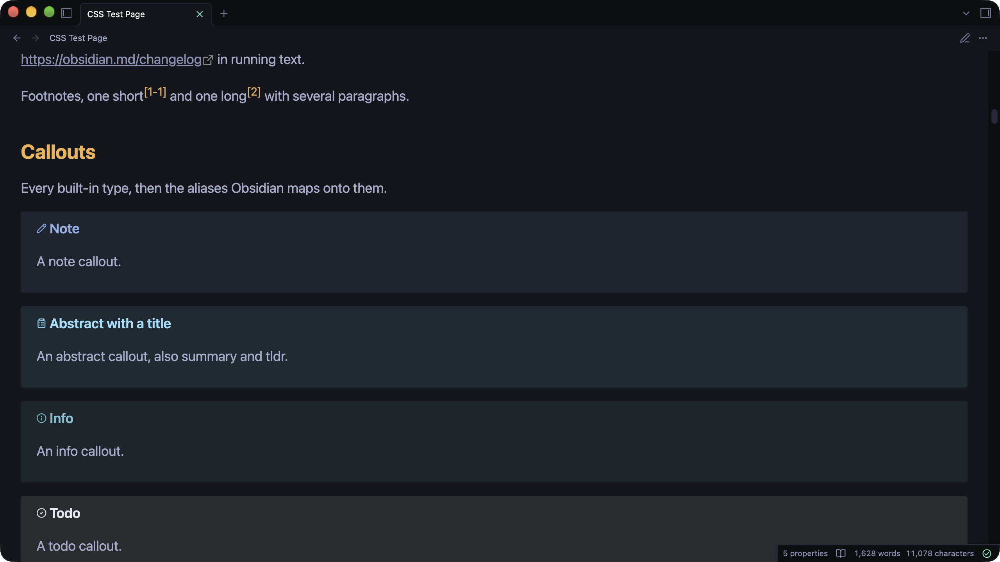
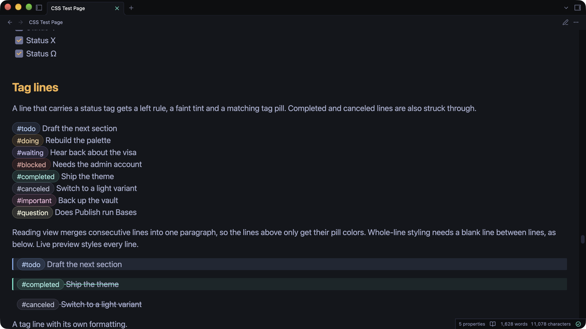

# Tenebrous

A dark theme for Obsidian that focuses on contrast. The colors come from [Tenebrous](https://github.com/sigrunixia/Tenebrous), a custom color scheme I have made.

This theme is very opinionated. I built it around how I use Obsidian, so I will not accept feature requests or changes to it. If you want it different, fork it and make it yours.

## Features

### Callouts

Every callout has unique colors. 

### Tag lines

Lines that carry a status tag get a left rule, a tint and a matching tag pill.

## Special thanks

- [Poimandres](https://github.com/drcmda/poimandres-theme) by drcmda, the original theme that inspired this full cascading mess.
- [Poimandres for Obsidian](https://github.com/yoGhastly/poimandres-obsidian) by yoGhastly, whose interpretation I used for a while.
- [Dbarenholz](https://github.com/dbarenholz) for dealing with me on [halcyon-obsidian](https://github.com/dbarenholz/halcyon-obsidian).
